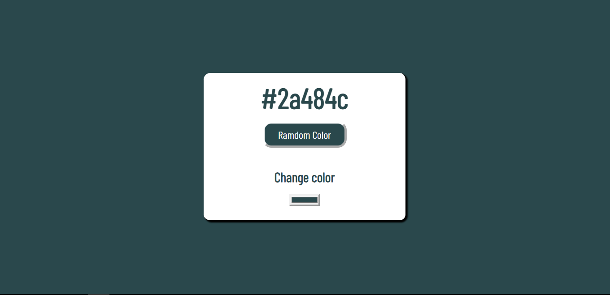

--Página que genera colores aleatorios en hexadecimales. Puede usar estos colores en sus proyectos de CSS copiando el código hexadecimal y pegándolo en su código. También puede elegir un color.

[ 

--La página es muy sencilla de usar. Simplemente haga clic en el botón "Generar nuevo color" para obtener un color aleatorio. Para elegir un color, simplemente haga clic en el color que desee.

--El color se muestra en el cuerpo de la página, ocupando toda la página. Esto facilita la visualización del color.

